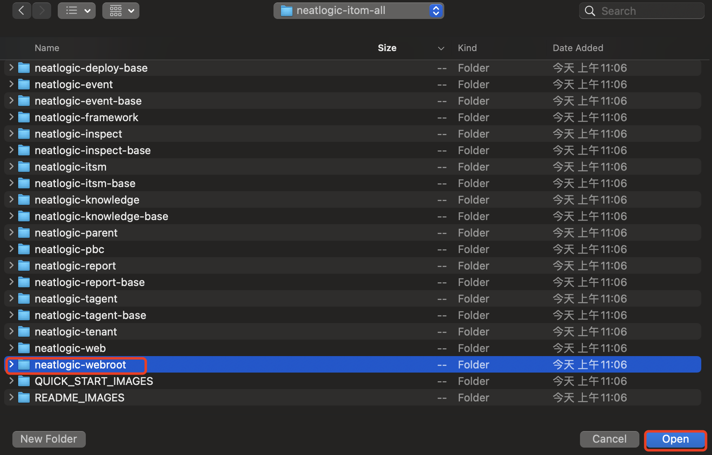
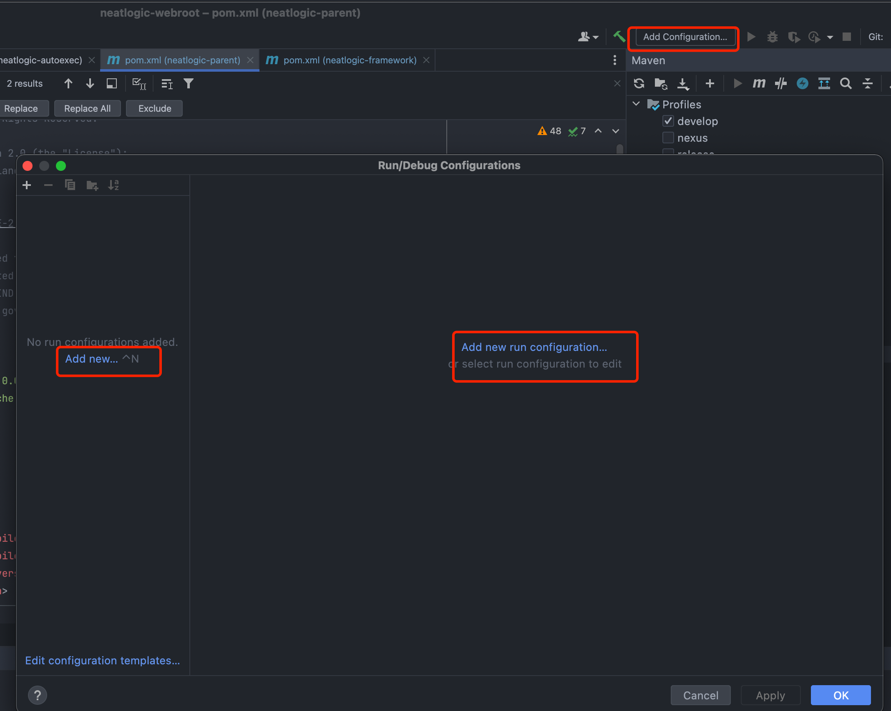
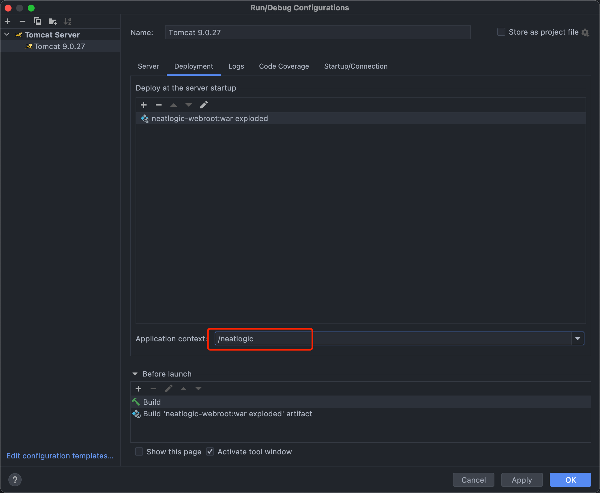

# 构建代码

## 下载项目所有代码
获取代码 签出neatlogic-itom-all可以一次性获取所有模块代码，由于neatlogic-itom-all使用submodule引入模块，签出代码时需加上--recurse-submodules参数。范例：
```
  git clone url --recurse-submodules
```

## idea 启动后端项目
### 新建workspace,并引入所有项目
> 打开项目

> 选择 neatlogic-webroot 模块打开

> 再添加其他模块


如上图,如果分支模块右侧的git分支号显示不是develop3.0.0则需要在neatlogic-itom-all目录下执行命令
```
git submodule foreach 'git checkout develop3.0.0'
```
### 配置maven


### 配置jdk 1.8


### 刷新maven依赖

### 配置tomcat9




```
//VM Option
//nacos 配置,会优先使用nacos,获取不到config则会从config.properties中获取
-Dnacos.home=192.168.0.10:8848 
-Dnacos.namespace=lvzk_local 
//日志级别
-Dlog4j.priority=ERROR 
-Drunmode=develop 
//设置true则登录用户无需密码
-DenableNoSecret=false 
//开启运维模式
-DenableSuperAdmin=true
```

### 配置config

> 需要修改下图中jdbc链接,mysql8 的账号密码

### 创建初始化数据库
>因为我们系统是支持多租户模式,所以我们架构是采用主库(neatlogic)+租户库的模式(neatlogic_租户名)+租户库动态数据和视图(neatlogic_租户名_data)
目前为了快速搭建直接定义demo租户,并采用以下比较low的方式初始化数据库,后续会提供脚本一键初始化:<br>
首先得创建手动以上提到的三个空库因为时间关系,注意编码是“utf8mb4”,排序规则是“utf8mb4_general_ci”,如下图:
<br>
然后执行sql [neatlogic.sql](neatlogic.sql)  和 [neatlogic_demo.sql](neatlogic_demo.sql) 进行初始化数据.
### 启动tomcat
如果出现一下日志,说明后端已经启动成功.

## vscode启动前端项目 to be continued...持续更新