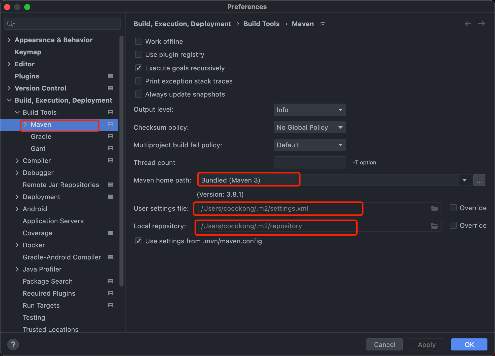
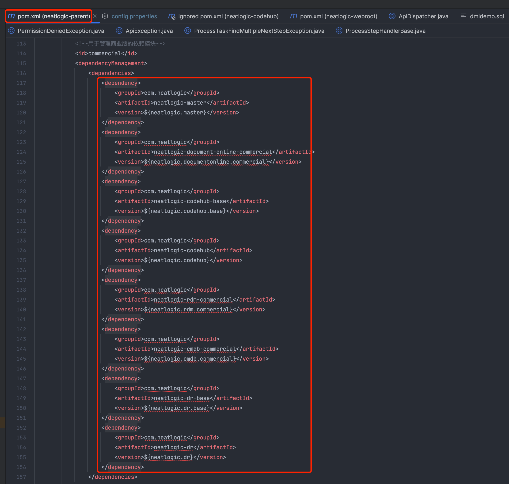
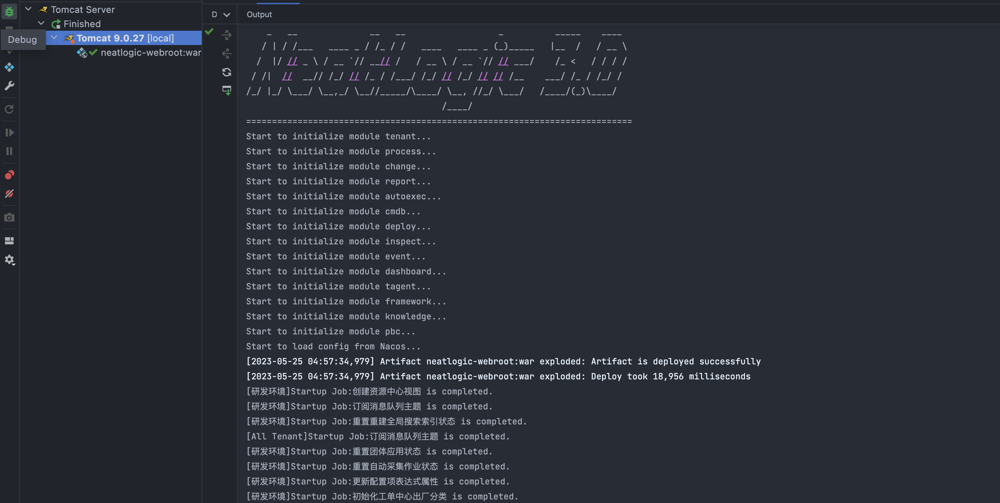
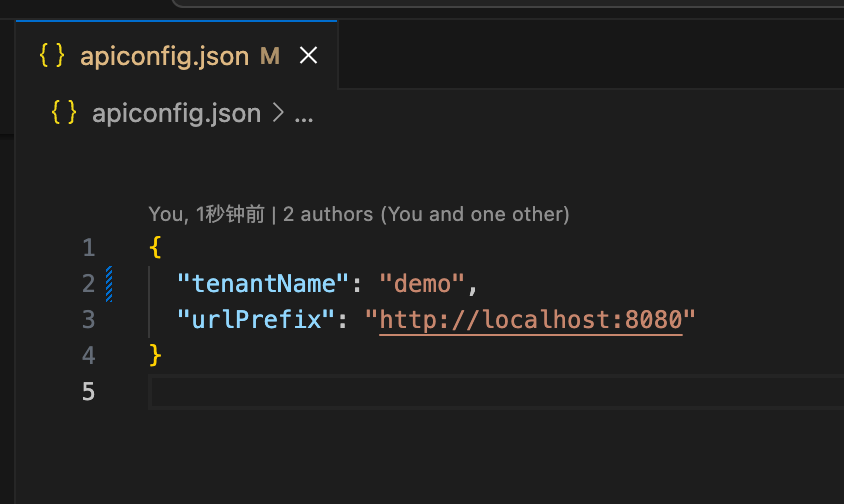
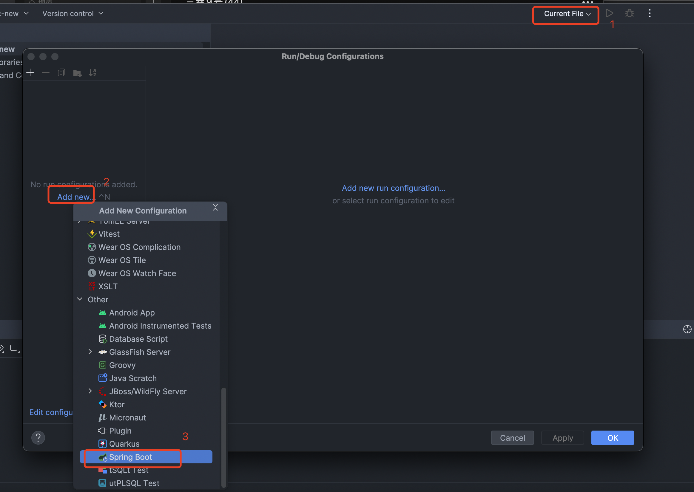
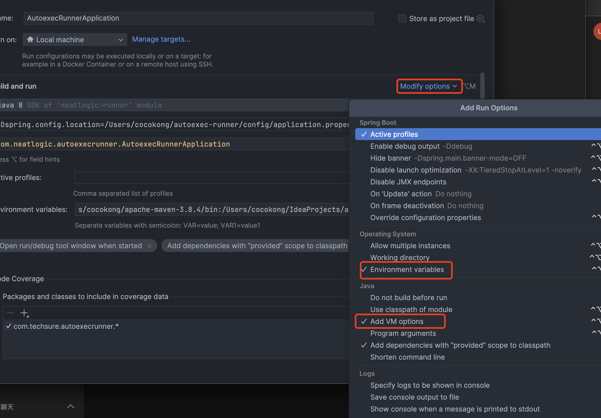
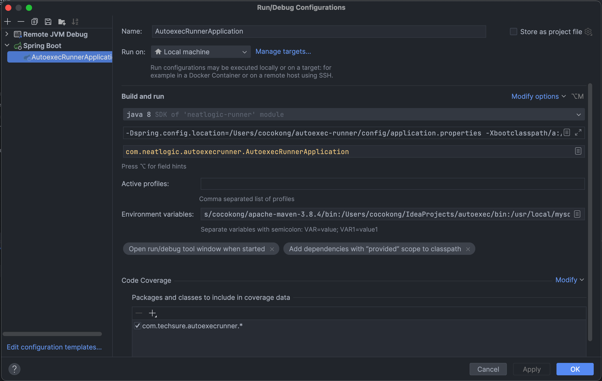
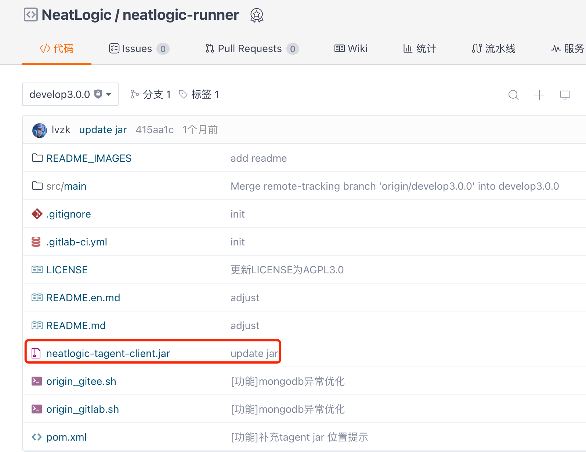

中文 / [English](CODE-BUILD.en.md)

# 研发环境搭建
本文档讲解neatlogic-webroot(neatlogic-springboot)、neatlogic-runner、neatlogic-web 三个项目的研发环境搭建，neatlogic业务模块较多，其中关系请查阅下面的服务架构图：

>  :star:   **其中页面后端可以通过两种方式启动** 
> - :point_right:  neatlogic-webroot : 外置tomcat9启动
> - :point_right:  neatlogic-springboot : springboot启动
## 下载项目所有代码
获取代码 签出neatlogic-itom-all可以一次性获取所有模块代码，由于neatlogic-itom-all使用submodule引入模块，签出代码时需加上--recurse-submodules参数。范例：
```
  git clone url --recurse-submodules
```

##  后端IntelliJ IDEA配置(2022.2.4+)
### ❗❗❗  注意
```js
 ❗❗❗" idea版本必须大于 2022.2.4，否则maven的profile特性不兼容，导致maven依赖问题 "   
```
### 新建workspace,并引入所有项目
> 打开项目

> 选择 neatlogic-webroot 模块打开

> 再添加其他模块


如上图,如果分支模块右侧的git分支号显示不是develop3.0.0则需要在neatlogic-itom-all目录下执行命令
```
git submodule foreach 'git checkout develop3.0.0'
#如果提示分支已存在，就先删除本地develop3.0.0分支
git branch -d develop3.0.0
```
### 配置maven(版本3.8+)
#### ❗❗❗ 注意
```js
 ❗❗❗" maven版本必须大于 3.8，否则maven的profile特性不兼容，导致maven依赖问题 "   
```
> 使用maven自带的setting.xml文件即可，如果存在网络问题，则需要通过私有nexus仓库或者别的方式下载第三方依赖了


### 配置JDK8
#### ❗❗❗ 注意
```js
 ❗❗❗" jdk版本必须是 8 "   
```


### 刷新maven依赖


> **:exclamation: :exclamation: 如果提示找不到neatlogic-parent,就先install下neatlogic-parent这个模块后，重新执行上图“刷新maven依赖”操作** 

> :grey_exclamation: 如果刷新后提示Could not find artifact 以下商业模块，则是正常的，执行后续步骤即可


### 配置后端
>  :star:   **其中页面后端可以通过两种方式启动，按需配置其中一种即可** 
> - :point_right:  neatlogic-webroot : 外置tomcat9启动
> - :point_right:  neatlogic-springboot : springboot启动
#### 通过外置Tomcat9启动后端 neatlogic-webroot


##### 指定本地Tomcat
###### ❗❗❗ 注意
```js
 ❗❗❗" tomcat版本必须是 9 "   
```

###### 配置VM Options
```
//nacos配置，会优先使用nacos，获取不到config则会从config.properties中获取
-Dnacos.home=192.168.0.10:8848 
-Dnacos.namespace=lvzk_local 
//日志级别
-Dlog4j.priority=ERROR 
//设为true，输入用户名后可使用任意密码登录，只能在研发阶段使用！
-DenableNoSecret=false
//确保JVM使用UTF-8编码来解释和处理文本数据,否则可能会导致中文乱码
-Dfile.encoding=UTF-8 
```
###### 配置deployment


###### 配置context

###### 配置自动构建的时机

##### 配置config.properties
nacos的配置文件模板如下，如果不使用nacos，则需要配置在config.properties中：
``` properties
#database properties
db.driverClassName = com.mysql.cj.jdbc.Driver
db.url = jdbc:mysql://localhost:3306/neatlogic?characterEncoding=UTF-8&jdbcCompliantTruncation=false&allowMultiQueries=true&useSSL=false&&serverTimeZone=Asia/Shanghai
db.username = root
db.password = password
db.dataSource.maxTotal=10
 
conn.validationQuery = select 1
conn.testOnBorrow = true
conn.maxActive = 50
conn.initialSize = 4
conn.maxIdle=16
#minio配置，如果不配置，默认使用本地存储
minio.url = http://localhost:8989
minio.accesskey = minioadmin
minio.secretkey = minioadmin
#本地存储起始文件夹，如果调用minio失败，会自动转存到这里，如果需要多服务共享附件，此路径请配置到nas卷上。
data.home = /app/data

#自己的服务地址，主要用于内部跳转
home.url = http://localhost:8099/

#active MQ地址，没有可以不用配
jms.url = tcp://localhost:61616
#如果mq需要认证，则需要配置认证账号密码，否则无需配置
jms.user = neatlogic
jms.password = 123456

#心跳设置
heartbeat.rate = 3
heartbeat.threshold = 5

```
##### 将neatlogic-resources的localconfig目录定义为资源目录

##### 将config目录定义为资源目录


#### 通过neatlogic-springboot来启动neatlogic后端
##### 将neatlogic-resources的localconfig目录定义为资源目录

##### 需要将config目录标记为资源根目录

##### 设置VM options如下：
```
    //nacos配置，会优先使用nacos，获取不到config则会从config.properties中获取
    -Dnacos.home=192.168.0.10:8848
    -Dnacos.namespace=neatlogic
    //日志目录
    -Dlog4j.home=D:\logs2
    //日志级别
    -Dlog4j.priority=ERROR
    //设为true，输入用户名后可使用任意密码登录，只能在研发阶段使用！
    -DenableNoSecret=false
    //确保JVM使用UTF-8编码来解释和处理文本数据,否则可能会导致中文乱码
    -Dfile.encoding=UTF-8
```


### 创建mysql8数据库
#### neatlogic需要使用3个库，字符集采用utf8mb4，排序规则采用utf8mb4_general_ci，由于neatlogic需要动态创建、删除表和视图，请授予数据库连接用户适当的权限。
  + neatlogic：管理库，所用租户共用，用于管理租户信息（租户数据库配置信息等），管理系统的健康状态等。
  + neatlogic_xxx：xxx租户库，xxx租户的数据都保存在这个库。
  + neatlogic_xxx_data：xxx租户的扩展库，用于存放所有由系统自动生成的表和视图。人工构建时需要手动创建这个空库
#### 为了方便理解，以下使用demo租户作为演示。
  1. 请先按照上述说明创建了3个空库neatlogic、neatlogic_demo和neatlogic_demo_data,如下图。
   
  2. 导入样例数据:[neatlogic-database/mysql](../../../neatlogic-database/blob/develop3.0.0/mysql) 将三个sql文件按名字分别导入到三个库。
  3. 修改neatlogic库的datasource表，找到tenant_uuid=demo的那行数据，核对username、password、host和port是否正确配置，其它字段不要修改！
  >部署完前端后可以使用账号:admin 密码:neatlogic@901 登录demo租户
#### 更换租户（为减少不必要的错误， <span style="color:red;">_新搭建环境请跳过该步骤，请勿执行！请勿执行！请勿执行！_</span> 建议先用上述demo租户启动成功并熟悉后，需要上生产环境再来更换）
  1. 这里我们假设需要把demo换成uat租户。新建数据库neatlogic_uat和neatlogic_uat_data数据库，字符集同样是采用utf8mb4，排序规则采用utf8mb4_general_ci
  2. 将neatlogic_demo表和数据同步到neatlogic_uat，neatlogic_demo_data只需要把表数据同步到neatlogic_uat_data，视图无需同步，启动服务是会自动重建
  3. 进入neatlogic库将tenant表、datasource表、mongodb表和tenant_modulegroup表中的“demo”字眼的数据都替换成“uat”
  4. 重启tomcat即可
      

### 创建mongodb数据库（如果涉及cmdb配置管理、自动化、巡检和发布模块则需要操作该步骤）
  用于存储自动化作业、采集和巡检等数据。
#### 为了方便理解，一下使用demo租户作业演示
  1. 创建neatlogic_demo空库
  2. 导入定义数据:[neatlogic-database/mongodb](../../../neatlogic-database/blob/develop3.0.0/mongodb/autoexec) ,通过mongostore导入即可
  3. 修改 **mysql** 数据库中的neatlogic库的mongodb表,找到tenant_uuid=demo的那行数据，核对database、username、password、host和option是否正确配置

### 启动后端服务
如果出现一下日志，说明后端已经启动成功.
#### 如果是外置tomcat9

#### 如果是springboot

> 检查后端服务是否正常
> 浏览器访问 http://localhost:8080/neatlogic/tenant/check/demo
> 


## 前端vue项目研发搭建
>  :boom: 后端服务正常后再执行后续操作
### 安装使用v18.x版本的node
```
英文网址：https://nodejs.org/en/download
中文网址：https://nodejs.cn/en/download
```
### 安装使用v8.2.0 cnpm
```
npm install cnpm@8.2.0 -g --registry=https://registry.npm.taobao.org
```
> 如果启动时发现大量不明报错，可能原因是npm install阶段加载的依赖包不完整导致，可以对npm进行降级再次install，目前测试v18的npm可以正常install。或者通过cnpm install加载依赖包也可以。cnpm版本也不能太高，建议使用v8.2.0。建议使用nvm管理多版本的node，使用v18.x版本的node会比较稳定。
### 安装依赖
```
cnpm install
```

### 设置vscode的个人配置
为了统一代码风格，多人开发时不会出现格式错乱，进行二开时请使用相同的代码风格配置。
#### 安装插件
EsLint、vetur、Prettier - Code formatter、i18nhelper(自动进行i18n键值替换和多语言翻译)

#### 设置>命令面板>输入“setting”>选择“首选项：打开设置”>打开 settings.json
```
{
   "gitlens.views.repositories.files.layout": "list",
    "git.confirmSync": false,
    "gitlens.advanced.similarityThreshold": null,
    "editor.tabSize": 2,
    "vetur.validation.script": true,
    "vetur.validation.style": true,
    "vetur.format.defaultFormatter.html": "js-beautify-html",
    "editor.formatOnSave": false,
    "vetur.format.defaultFormatterOptions": {
      "js-beautify-html": {
        "wrap_attributes": "auto",
        "indent_size": 2,
        "indent_char": " ",
        "indent_with_tabs": false,
        "eol": "\n",
        "end_with_newline": true,
        "preserve_newlines": true,
        "max-preserve-newlines": 3,
        "indent-inner-html": true,
        "wrap_line_length": 120,
        "editorconfig": true
      }
    },
    "html.format.maxPreserveNewLines": 3,
    "html.format.enable": false,
    "[vue]": {
      "editor.defaultFormatter": "dbaeumer.vscode-eslint"
    },
    "[less]": {
      "editor.defaultFormatter": "esbenp.prettier-vscode"
    },
    "gitlens.advanced.blame.customArguments": [],
    "[javascript]": {
      "editor.defaultFormatter": "vscode.typescript-language-features"
    },
    "[css]": {
      "editor.defaultFormatter": "HookyQR.beautify"
    },
    "[html]": {
      "editor.defaultFormatter": "esbenp.prettier-vscode"
    },
    "javascript.updateImportsOnFileMove.enabled": "always",
  
      "[json]": {
      "editor.defaultFormatter": "esbenp.prettier-vscode"
    },
    "[git-commit]": {
      "editor.rulers": [
        72
      ],
      "workbench.editor.restoreViewState": false
    },
    "gitlens.advanced.messages": {},  
    "gitlens.gitCommands.closeOnFocusOut": true,
    "workbench.startupEditor": "newUntitledFile",
    "npm.enableRunFromFolder": true,
    "editor.codeActionsOnSave": {
      "source.fixAll.eslint": true
    },
    "editor.autoClosingBrackets":"always",
    "security.workspace.trust.untrustedFiles": "newWindow",
    "workbench.editorAssociations": {
      "*.html": "default"
    },
    "editor.unicodeHighlight.ambiguousCharacters": false,
    "diffEditor.ignoreTrimWhitespace": false,
    "eslint.alwaysShowStatus": true,
    "eslint.format.enable": true,
    "extensions.ignoreRecommendations": true,
    "npm.keybindingsChangedWarningShown": true,
    "settingsSync.ignoredSettings": [],
    "window.zoomLevel": 1,
    "typescript.disableAutomaticTypeAcquisition": true,
    "editor.suggest.snippetsPreventQuickSuggestions": false,
    "eslint.codeActionsOnSave.rules": null
} 
```
### 修改前端访问后端的ip:port，以及租户
>需修改apiconfig.json配置文件,将tenantName的值修改为在用的租户（如果使用的是官方提供的用例数据，则租户就是demo），urlPrefix改成neatlogic后端tomcat服务的http://ip:port


### 启动项目
```
cnpm run serve
```
#### 检查前端服务是否正常
浏览器访问 http://前端ip:前端port/demo #其中demo是租户（前端ip:前端port 可以从vscode的控制台日志获取）

账号/密码： admin/neatlogic@901
> 如果前端控制台Compiled successfully 成功启动，访问还是异常
>1. 后端服务没有启动。浏览器访问http://后端ip:后端port/neatlogic/tenant/check/demo 是否正常返回
>2. 前端项目的配置文件改错了（只需要按要求修改apiconfig文件，其它文件无需改动）。浏览器访问http://前端ip:前端port/demo/tenant/check 是否正常返回。 确认前端服务是否正常启动
>3. 防火墙没有开通（当然前后端浏览器都是localhost就排除这个原因）。到部署前端服务的服务器上请求后端http://后端ip:后端port/neatlogic/tenant/check/demo 是否正常返回

### 其它
#### 升降级级node版本

- 清理npm缓存：
```
npm cache clean -f
```
- 安装版本管理工具：
```
npm install -g n
```
- 升级到最新的版本：
```
n latest（最新版本）
n stable（最新稳定版本）
```
- 指定版本： 
```
n 18.16.0
```
#### 降低cnpm版本
1. 这里是列表文本先卸载cnpm 
```
npm uninstall -g cnpm
```
2. 这里是列表文本再安装低版本的cnpm 
```
npm install cnpm@8.2.0 -g --registry=https://registry.npm.taobao.org
```
#### 其它常用的命令
```
##### 升级依赖包
cnpm update <package-name>

##### 查看已安装的包
cnpm list
```

## neatlogic-runner项目IntellJ IDEA环境搭建（如果不涉及到CMDB采集、自动化、巡检相关功能此项目请忽略）
### ❗❗❗  注意
```js
 ❗❗❗" 仅支持mac或linux环境下研发 "   
```
### 配置

确保下图中的“Add VM Option”和“Environment variables”被钩选上

配置VM Option
```
//项目配置文件
-Dspring.config.location=/Users/cocokong/autoexec-runner/config/application.properties 
//启动类路径
-Xbootclasspath/a:/Users/cocokong/autoexec-runner/config/
```
配置环境变量
```
PATH 需加上 neatlogic-autoexec-backend项目的bin路径，否则执行作业会抛“找不到autoexec program”异常
如：/Users/cocokong/IdeaProjects/neatlogic-autoexec-backend/bin
```

### 配置文件
```
#SERVER
#应用名
spring.application.name=autoexecrunner
server.port=8084
server.servlet.context-path=/${spring.application.name}

# SPRING AOP CONFIG
spring.aop.auto=true
spring.aop.proxy-target-class=true

# UPLOAD FILE CONFIG
#上传限制
spring.servlet.multipart.enabled=true
spring.servlet.multipart.max-request-size=100MB
spring.servlet.multipart.max-file-size=100MB

#NEATLOGIC WEB
#neatlogic后端应用地址
neatlogic.root=http://127.0.0.1:8080/neatlogic
#认证 连接时校验
auth.type=basic
access.key=neatlogic
access.secret=x15wDEzSbBL6tV1W


#RUNNER
#runner根路径
runner.home=/Users/cocokong/autoexec-runner

#LOGGER
#日志级别
logging.config=${runner.home}/config/logback-spring.xml
logging.home=${runner.home}/logs/autoexec-runner
logging.level.root=DEBUG

#NEATLOGIC-AUTOEXEC-BACKEND
#neatlogic-autoexec-backend自动化作业数据路径
autoexec.home=/Users/cocokong/IdeaProjects/autoexec/data/job

#DEPLOY
#neatlogic--autoexec-backend发布版本数据路径
deploy.home=/app/autoexec/data/verdata
 
#neatlogic--autoexec-backend数据根路径
data.home=${runner.home}/data

#tagent 安装包下载目录，将文件放在这个目录，就可以通过“http://ip:8084/autoexecrunner/tagent/download/” +文件名下载文件
tagent.download.path=/app/autoexec/data/tagent/
```
### 添加neatlogic-tagent-client.jar到项目中，或者私有的nexus仓库

### 启动即可


## 使用干净的租户，完全重新初始化（为减少不必要的错误， <span style="color:red;">_新搭建环境请跳过该步骤，请勿执行！请勿执行！请勿执行！_</span> 建议先用上述demo租户启动成功并熟悉后，再来清空数据）
为了方便介绍以创建uat租户为例
### mysql库
- 清空neatlogic_uat_data库中所有表和视图（结构和数据）
- 仅清空neatlogic库和neatlogic_uat中所有数据
执行以下语句：
> 注意需调整sql，即datasource表 核对username、password、host和port是否正确配置，其它字段不要修改！另外mongodb表的数据需要按自己的情况修改正确
```
INSERT INTO `neatlogic`.`tenant` (`uuid`, `name`, `is_active`, `status`, `expire_date`, `description`, `error_msg`, `is_need_demo`, `visit_time`, `fcd`) VALUES ('uat', 'uat环境', 1, NULL, NULL, NULL, NULL, 0, NULL, NULL);

INSERT INTO `neatlogic`.`datasource` (`tenant_uuid`, `url`, `username`, `password`, `driver`, `host`, `port`) VALUES ('uat', 'jdbc:mysql://{host}:{port}/{dbname}?characterEncoding=UTF-8&jdbcCompliantTruncation=false&allowMultiQueries=true&useSSL=false&&serverTimeZone=Asia/Shanghai', 'root', 'password', 'com.mysql.cj.jdbc.Driver', 'localhost', 3306);

INSERT INTO `neatlogic`.`mongodb` (`tenant_uuid`, `database`, `username`, `password`, `host`, `option`, `auth_config`) VALUES ('uat', 'autoexec', 'autoexec', 'u1OPgeInMhxsNkNl', '192.168.4.140:27017,192.168.2.2:27017,192.168.3.1:27017', 'authSource=admin', NULL);

INSERT INTO `neatlogic`.`tenant_modulegroup` (`tenant_uuid`, `module_group`) VALUES ('uat', 'autoexec');
INSERT INTO `neatlogic`.`tenant_modulegroup` (`tenant_uuid`, `module_group`) VALUES ('uat', 'cmdb');
INSERT INTO `neatlogic`.`tenant_modulegroup` (`tenant_uuid`, `module_group`) VALUES ('uat', 'dashboard');
INSERT INTO `neatlogic`.`tenant_modulegroup` (`tenant_uuid`, `module_group`) VALUES ('uat', 'deploy');
INSERT INTO `neatlogic`.`tenant_modulegroup` (`tenant_uuid`, `module_group`) VALUES ('uat', 'framework');
INSERT INTO `neatlogic`.`tenant_modulegroup` (`tenant_uuid`, `module_group`) VALUES ('uat', 'inspect');
INSERT INTO `neatlogic`.`tenant_modulegroup` (`tenant_uuid`, `module_group`) VALUES ('uat', 'knowledge');
INSERT INTO `neatlogic`.`tenant_modulegroup` (`tenant_uuid`, `module_group`) VALUES ('uat', 'process');
INSERT INTO `neatlogic`.`tenant_modulegroup` (`tenant_uuid`, `module_group`) VALUES ('uat', 'rdm');
INSERT INTO `neatlogic`.`tenant_modulegroup` (`tenant_uuid`, `module_group`) VALUES ('uat', 'report');
```
### mongodb库
保留下划线"_"开头的集合即可
### 修改JVM OPTION以及配置文件，再重新启动后端tomcat服务
#### 修改JVM OPTION
```
-DenableMaintenance=true
```
#### 修改config.properties或者nacos
```
maintenance=maintenance
maintenance.password=123456ab 
```
重启tomcat，并确保服务正常启动
使用 http://localhost:8080/neatlogic/tenant/check/uat 校验
### 前端登录页面
> 注意如果是本地研发环境仍需修改neatlogic-web项目的apiconfig.json中的tenantName为uat

使用上面配置的maintenance用户登录页面
账号：maintenance 密码：123456ab <br>
登录后可以添加用户、组、角色，以及授权。添加完用户后就可以把上述的JVM OPTION以及配置文件删除，重启后端tomcat服务，使用刚添加好的用户登录

## FAQ常见问题
### 前端项目 npm ERR! request to https://registry.npm.taobao.org/cnpm failed, reason: certificate has expired
```
npm config set strict-ssl false
```

### 后端tomcat启动异常处理
- 乱码问题
  先解决工具控制台编码问题，我们统一用UTF-8,然后按错误提示操作解决即可

