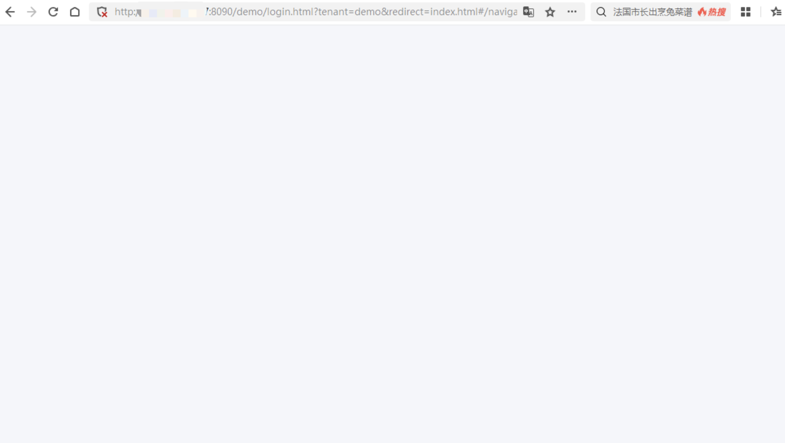

中文 / [English](QUICK_START.en.md)
# 项目部署教程
## ❗❗❗注意
```js
 ❗❗❗"目前镜像支持 centos7/8/9"

```

## Docker环境检查

检查docker版本(返回版本信息，说明docker已安装)
```
docker --version
docker-compose --version
```
> 注意:请确保docker已安装,才能进行后续步骤
## 安装
先下载 [docker-compose.yml](docker-compose.yml),该配置文件是docker compose的核心，用于定义服务、网络和数据卷。
> 注意:如果需要用到 [neatlogic-runner](../../../neatlogic-runner/blob/develop3.0.0/README.md) ,还需要修改[docker-compose.yml](docker-compose.yml)文件中NEATLOGIC_RUNNER_HOST环境变量,设置为runner容器所在的宿主机ip

如果不做修改,直接执行启动命令
```
  docker-compose -f docker-compose.yml up -d  #-f 表示执行指定yml, -d 表示后台执行并返回
```
默认会安装一下容器服务:
|  容器服务名  |  默认宿主机端口  | 启动容器服务依赖 | 访问地址 |容器内服务启停命令 |   描述 |
| ----  | ----  | ----  | ---- | ---- | ---- |
|  neatlogic-db  |  3306  | - | - |  service neatlogicdb start/stop/restart  |mysql数据库, 账号/密码 root/neatlogic@901, client连接通过命令： /app/databases/neatlogicdb/mysql/bin/mysql -uroot -p'neatlogic@901' --socket=/app/databases/neatlogicdb/data/mysql.sock|
|  neatlogic-collectdb |  27017  | - | - |   service collectdb start/stop/restart  |mongodb,如果使用cmdb自动采集、自动化、巡检、发布则需要该服务 |
|  neatlogic-runner  |  8084、8888 | - | - | deployadmin -s neatlogic-runner -a startall/stopall/restartall |执行器,如果使用发布、巡检、自动化、tagent则需要该服务.注意：为了镜像简洁精干，自动化工具某些场景里作业日志提示的额外依赖问题，需要自己在容器里额外解决。 |
|  neatlogic-app  |  8282  | neatlogic-db <br> neatlogic-collectdb <br>neatlogic-runner<br>neatlogic-nacos| - | deployadmin -s neatlogic -a startall/stopall/restartall | 后端服务|
|  neatlogic-web  |  8090  | neatlogic-app | 宿主机IP:8090  |service nginx start/stop/restart | 前端服务, 账号/密码 admin/neatlogic@901|
|  neatlogic-nacos | 8848 | neatlogic-db | 宿主机IP:8848/nacos | deployadmin -s nacos -a startall/stopall| 后端服务 config ,账号/密码 nacos/nacos|

## 验证
## ❗❗❗注意
```js
 ❗❗❗"浏览器请用chrome 90+，其他浏览器或版本可能存在兼容问题"

```
因为docker容器服务启动是异步的,所以以上提到的启动命令执行完也不代表服务都正常启动完了.<br>
仍需要等待几分钟时间后访问前端服务:http://宿主机ip:8090/ 如果出现登录页面,恭喜你服务部署成功.登录账号:admin 密码:neatlogic@901<br>
如果提示租户不存在,则需要查看下日志,可能是服务还在等待启动中
```
docker-compose -f docker-compose.yml logs -f neatlogic-web
```
如果日志出现neatlogic-web service start.那就需要进入neatlogic-app容器，查看错误日志/app/logs/neatlogic/error.log 和启动日志app/logs/neatlogic/neatlogic.out 
如果日志中出现error,则将最后的截图（最好是整个日志文件）联系我们:
- **企业微信** <br>
<p align="left"></p>

## 按需修改配置 docker-compose.yml
### 一般常见需要修改的场景:
**1、数据持久化**
默认是没有配置持久化的,持久化配置稍后更新...

**2、宿主机端口冲突**

修改 ports 字段即可,例如neatlogic-web的8090端口冲突,则需要将左侧的宿主机端口改成非占用端口即可,如我要改成8081:
```
  ports:
    - "8090:8081"
```

**3、不使用自带的容器服务**

如无需某容器服务则只需要删除对应容器服务配置,且修改对应被依赖的容器服务的environment属性<br>
如无需neatlogic-db,因neatlogic-db被neatlogic-app和neatlogic-nacos依赖,所以neatlogic-app和neatlogic-nacos都需要修改environment的MYSQL_SERVICE_HOST、MYSQL_SERVICE_PORT、MYSQL_SERVICE_USER、MYSQL_SERVICE_PASSWORD,如:<br>
自定义使用外部mysqldb 192.168.1.33:3306,帐号/密码:app/123456
```
  environment:
    #连接的mysql配置
    MYSQL_SERVICE_HOST: "192.168.1.33"
    MYSQL_SERVICE_PORT: 3306
    ...
    MYSQL_SERVICE_USER: app
    MYSQL_SERVICE_PASSWORD: "123456"
```
# 常用COMMAND
## 启动
根据yml创建容器并启动所有容器服务
```
  docker-compose -f docker-compose.yml up -d  #-f 表示执行指定yml, -d 表示后台执行并返回
```
如果只需要处理某个容器服务,只需要在命令后补充容器服务名即可,如:
```
  docker-compose -f docker-compose.yml up -d neatlogic-app #单独重新创建并启动neatlogic-app服务
```

## 查看日志
查看所有容器服务的日志
```
  docker-compose -f docker-compose.yml logs
```
如果只需要查看某个容器服务的日志,只需要在命令后补充容器服务名即可,如:
```
  docker-compose -f docker-compose.yml logs neatlogic-app
```
### 实时查看日志
```
  docker-compose -f docker-compose.yml logs -f
```

## 查看启动成功的容器
```
  docker-compose -f docker-compose.yml ps
```

## 启停容器
### 启容器
```
  docker-compose -f docker-compose.yml start
```
### 停容器
```
  docker-compose -f docker-compose.yml stop 
```
如果只需要启某个容器,只需要在命令后补充容器服务名即可,如:
```
  docker-compose -f docker-compose.yml start neatlogic-app
```

## 进入容器服务
>非必要用户无需进入容器服务,如进去neatlogic-app容器服务:
```
  docker-compose -f docker-compose.yml exec neatlogic-app sh
```
## 停止并移除容器，网络，镜像和卷
```
  docker-compose -f docker-compose.yml down 
```

## 批量拉取镜像
```
  docker-compose -f docker-compose.yml pull
```

## demo样例数据参考（注意：确保登录界面出来后，已经可以登录系统，还想要更具体的数据才执行以下步骤）
由于考虑到环境的干净,镜像只保留了核心数据.如果仍需要更多的样例数据作为参考,可执行一下步骤
  1. 请先创建了3个空库neatlogic、neatlogic_demo和neatlogic_demo_data,字符集采用utf8mb4，排序规则采用utf8mb4_general_ci，由于neatlogic需要动态创建、删除表和视图，请授予数据库连接用户适当的权限，如下图。
   
  2. 导入样例数据:[neatlogic-database/mysql](../../../neatlogic-database/blob/develop3.0.0/mysql) 将三个sql文件按名字分别导入到三个库。
  3. 修改neatlogic库的datasource表，找到tenant_uuid=demo的那行数据，核对username、password、host和port是否正确配置

## 更换租户（为减少不必要的错误， <span style="color:red;">_新搭建环境请跳过该步骤，请勿执行！请勿执行！请勿执行！_</span> 建议先用上述demo租户启动成功并熟悉后，需要上生产环境再来更换）
  1. 这里我们假设需要把demo换成uat租户。新建数据库neatlogic_uat和neatlogic_uat_data数据库，字符集同样是采用utf8mb4，排序规则采用utf8mb4_general_ci
  2. 将neatlogic_demo表和数据同步到neatlogic_uat，neatlogic_demo_data只需要把表数据同步到neatlogic_uat_data，视图无需同步，启动服务是会自动重建
  3. 进入neatlogic库将tenant表、datasource表、mongodb表和tenant_modulegroup表中的“demo”字眼的数据都替换成“uat”
  4. 重启neatlogic-app服务即可

## FAQ常见问题
### 1. 日志出现 Permission denied

解决办法：关闭SELinux或AppArmor
### 2. 执行自动化作业出现 sudo: command not found
```
yum install sudo
```
### 3.执行自动化作业作业出现 Execute nmap failed, check the sudoers setting for user app to execute command nmap.
```
vi /etc/sudoers 
//在最后增加一行授权 
app ALL=(root) NOPASSWD:ALL 
```
### 如果浏览器出现空白无法访问

1. 先检查浏览器，要求chrome 90+版本
2. 如果看neatlogic-web启动日志提示"neatlogic-web service start." 浏览器还是空白页 就进到neatlogic-web容器检查 nginx 服务是否正常
3. 到docker的宿主机器lsof -i:8090 看下端口是否正常 telnet localhost 8090
4. 到本地电脑  telnet docker的宿主机器ip 8090 是否通